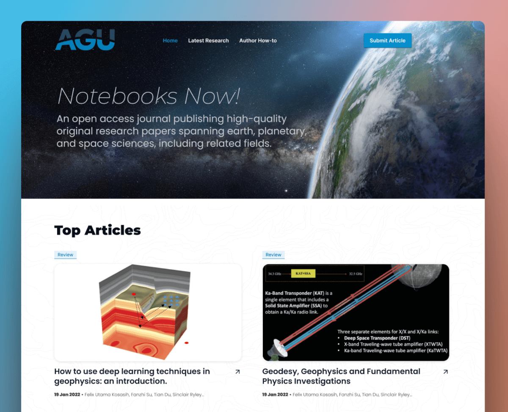

[Notebooks Now!](https://data.agu.org/notebooks-now/) is an AGU initiative to define a standard for publishing with Computational Notebooks.

The project is establishing Computational Notebook as a format for submission of research articles, further enabling reproducibility and interactivity within research publications, whilst making the notebook based format a first class part of the scientific record. As well as establishing the Notebook format as part of a submission, a machine readable approach is taken for all submission metadata.

This website provides guidance for authors on how to prepare a notebook based manuscript and repository for the AGU Notebooks Now submission, review and publication system.

## Submission Templates

Submissions are made by either providing a link to a public github repository or uploading a `.zip` file with the contents of your private repository. Although it's possible to put together your own repository with the [minimum requirements]() for submission, there are a number of template repositories available as a starting point. To get started with your submission using a template follow the [Getting Started Guide](/start).

## What to expect

Preparing your submission
: writing

Submission Process
: submitting

Automated checks
: checks

Automated Build
: builds

Review
: reviewers

Final Publication
: you're published!
